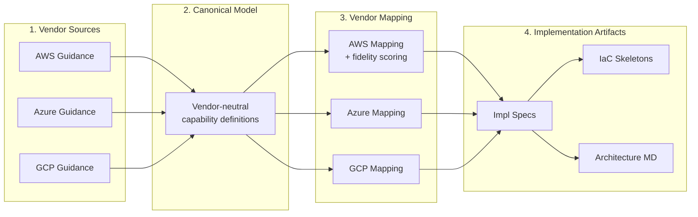

# multi-cloud-lifecycle-skills

[](LICENSE)
[![DeepWiki](https://img.shields.io/badge/DeepWiki-suwa--sh%2Fmulti--cloud--lifecycle--skills-blue.svg?logo=data:image/svg+xml;base64,PHN2ZyB3aWR0aD0iMTYiIGhlaWdodD0iMTYiIHZpZXdCb3g9IjAgMCAxNiAxNiIgZmlsbD0ibm9uZSIgeG1sbnM9Imh0dHA6Ly93d3cudzMub3JnLzIwMDAvc3ZnIj48cGF0aCBkPSJNMTEuMzMzMSA0LjY2NjY3QzExLjMzMzEgNi4xMzk0MyA5LjEzOTQzIDcuMzMzMzMgNy45OTk3NiA3LjMzMzMzQzYuODYwMSA3LjMzMzMzIDQuNjY2NDMgNi4xMzk0MyA0LjY2NjQzIDQuNjY2NjdDNC42NjY0MyAzLjE5MzkxIDYuODYwMSAyIDcuOTk5NzYgMkM5LjEzOTQzIDIgMTEuMzMzMSAzLjE5MzkxIDExLjMzMzEgNC42NjY2N1oiIGZpbGw9IndoaXRlIi8+PHBhdGggZD0iTTE0LjY2NjMgMTEuMzMzM0MxNC42NjYzIDEyLjgwNjEgMTIuNDcyNyAxNCAxMS4zMzMgMTRDMTAuMTkzMyAxNCA3Ljk5OTY3IDEyLjgwNjEgNy45OTk2NyAxMS4zMzMzQzcuOTk5NjcgOS44NjA1NyAxMC4xOTMzIDguNjY2NjcgMTEuMzMzIDguNjY2NjdDMTIuNDcyNyA4LjY2NjY3IDE0LjY2NjMgOS44NjA1NyAxNC42NjYzIDExLjMzMzNaIiBmaWxsPSJ3aGl0ZSIvPjxwYXRoIGQ9Ik04LjAwMDMzIDExLjMzMzNDOC4wMDAzMyAxMi44MDYxIDUuODA2NjcgMTQgNC42NjcgMTRDMy41MjczMyAxNCAxLjMzMzY3IDEyLjgwNjEgMS4zMzM2NyAxMS4zMzMzQzEuMzMzNjcgOS44NjA1NyAzLjUyNzMzIDguNjY2NjcgNC42NjcgOC42NjY2N0M1LjgwNjY3IDguNjY2NjcgOC4wMDAzMyA5Ljg2MDU3IDguMDAwMzMgMTEuMzMzM1oiIGZpbGw9IndoaXRlIi8+PC9zdmc+)](https://deepwiki.com/suwa-sh/multi-cloud-lifecycle-skills)

[ [日本語](README.ja.md) ]

Claude Code skill set for multi-cloud infrastructure design across AWS, Azure, and GCP.

Generates vendor-neutral canonical models, vendor-specific mappings, implementation specs, and IaC skeletons through a consistent design pipeline.

## Concept

**Build infrastructure designs through AI agent conversations — avoiding vendor lock-in while following each vendor's best practices.**

Cloud infrastructure design faces two contradictory requirements: "design without depending on a specific vendor" and "follow each vendor's recommended best practices." This skill set resolves this contradiction through a 4-layer design pipeline.



| Layer | Role | Lock-in Avoidance | Best Practice Adherence |
| --- | --- | --- | --- |
| **Vendor Sources** | Auto-collect and store official documentation | -- | Uses each vendor's latest recommendations as design rationale |
| **Canonical Model** | Express requirements as vendor-neutral capabilities | No dependency on vendor-specific terminology or concepts | Normalizes and reflects best practices extracted from sources |
| **Vendor Mapping** | Re-project canonical to each vendor's services | Visualizes fit with fidelity (exact/partial/workaround/gap). Makes gaps explicit | Follows vendor-recommended service selection and configuration |
| **Implementation Artifacts** | IaC skeletons, conformance reports | Verifies conformance to canonical. Only swap mapping when changing vendors | Reflects vendor-specific settings and module configurations |

With this 4-layer model, **when adding or changing clouds, only the Vendor Mapping and Implementation Artifacts need to be swapped** — the Canonical Model (the essence of the design) remains unchanged. In the included sample, GCP (BigQuery) was added mid-project without breaking the existing AWS / Azure designs.

The design process itself proceeds through conversation with Claude Code. Skills conduct structured interviews with choices, and auto-generate all artifacts based on answers. Designers can focus on architectural decisions while the skills handle YAML template authoring and cross-vendor difference research.

## Prerequisites

- [Claude Code](https://claude.ai/code)
- [pandoc](https://pandoc.org/) (used for vendor source HTML → Markdown conversion)

```bash
# macOS
brew install pandoc
```

## Installation

```bash
git clone https://github.com/suwa-sh/multi-cloud-lifecycle-skills.git
cd multi-cloud-lifecycle-skills
```

### Global Installation (available across all projects)

```bash
./install.sh
```

Creates symlinks in `~/.claude/skills/`, making skills available in any project.

### Project-specific Installation

```bash
./install.sh /path/to/your-project
```

Creates symlinks in `<project>/.claude/skills/`, making skills available only in that project.

## Skills

Three design skills work in a hierarchical structure. Each upper skill's output becomes the lower skill's input.

```
mcl-foundation-design          Top — defines guardrails
    ↓ foundation-context.yaml
mcl-shared-platform-design     Middle — defines shared services
    ↓ shared-platform-context.yaml
mcl-product-design             Bottom — designs individual workloads
```

| Skill | Scope | Key Outputs |
| --- | --- | --- |
| **mcl-foundation-design** | Landing zone (org structure, identity, network, policy, logging, billing, security) | canonical model, vendor mapping, decision records, IaC skeletons, foundation context |
| **mcl-shared-platform-design** | Shared platform (Kubernetes, monitoring, CI/CD, secret management) | canonical model, service catalog, vendor mapping, IaC skeletons, shared-platform context |
| **mcl-product-design** | Individual workloads (compute, DB, cache, messaging) | workload model, vendor mapping, observability spec, cost hints, IaC skeletons |
| **mcl-common** | Shared templates, schemas, and rules for all 3 skills (not directly triggered) | — |

## Usage

### Basic Flow

Request designs interactively in Claude Code. Skills trigger automatically.

```
# 1. Foundation (run first)
"Design a foundation for 3 BUs targeting AWS and Azure"

# 2. Shared Platform (run after foundation)
"Design a shared platform based on EKS/AKS"

# 3. Product (run after foundation + shared platform)
"Design the backend API for an e-commerce site"
```

### Specifying Target Clouds

All 3 clouds are supported, but you can specify a subset at invocation time.

```
"Design a foundation for AWS only"
"Design a shared platform for Azure and GCP"
```

### Vendor Source Handling

Skills work even without pre-prepared vendor sources. When sources are not found during design execution, the latest content is automatically collected from official guidance pages and saved as markdown.

```
docs/cloud-context/sources/
├── aws/          # AWS Well-Architected, CAF, EKS Best Practices, etc.
├── azure/        # Azure CAF, Landing Zone, AKS Best Practices, etc.
└── gcp/          # GCP Architecture Guidance, GKE Best Practices, etc.
```

Collection priority:
1. Summaries in `docs/cloud-context/summaries/{layer}/` (highest priority if available)
2. Saved sources in `docs/cloud-context/sources/{vendor}/`
3. Auto-collected from web (when above are absent)

To prepare sources in advance, export official page content as markdown and place in the directories above. See `.claude/skills/mcl-common/references/vendor-source-policy.md` for the list of collection target URLs.

## Design Pipeline

All skills follow a common 4-layer model.

```
Vendor Sources → Canonical Model → Vendor Mapping → Implementation Artifacts
```

| Layer | Content | Priority |
| --- | --- | --- |
| Vendor Sources | Official cloud vendor guidance | Highest |
| Canonical Model | Vendor-neutral capability representation | High |
| Vendor Mapping | Mapping to vendor-specific services (with fidelity scoring) | Medium |
| Implementation Artifacts | Impl specs, IaC skeletons, conformance reports | Low |

Higher layers take precedence on conflicts.

## Output Directory

When all 3 layers are executed for AWS + Azure, the following directory structure is generated in the target project.

```
your-project/
├── specs/
│   ├── foundation/
│   │   ├── input/                          # (optional) user input
│   │   └── output/
│   │       ├── foundation-canonical.yaml       # Vendor-neutral foundation model
│   │       ├── foundation-mapping-aws.yaml     # AWS mapping
│   │       ├── foundation-mapping-azure.yaml   # Azure mapping
│   │       ├── foundation-impl-aws.yaml        # AWS impl spec
│   │       ├── foundation-impl-azure.yaml      # Azure impl spec
│   │       └── foundation-context.yaml         # Input for downstream skills
│   ├── shared-platform/
│   │   └── output/
│   │       ├── shared-platform-canonical.yaml
│   │       ├── shared-platform-mapping-aws.yaml
│   │       ├── shared-platform-mapping-azure.yaml
│   │       ├── shared-platform-impl-aws.yaml
│   │       ├── shared-platform-impl-azure.yaml
│   │       ├── service-catalog.yaml            # Platform service catalog
│   │       └── shared-platform-context.yaml    # Input for downstream skills
│   └── product/
│       └── output/
│           ├── product-workload-model.yaml     # Workload definition
│           ├── product-mapping-aws.yaml
│           ├── product-mapping-azure.yaml
│           ├── product-impl-aws.yaml
│           ├── product-impl-azure.yaml
│           ├── product-observability.yaml      # SLI/SLO, alert definitions
│           └── product-cost-hints.yaml         # Cost optimization strategies
├── docs/
│   └── cloud-context/
│       ├── sources/                            # Vendor sources (auto-collected or manual)
│       │   ├── aws/
│       │   ├── azure/
│       │   └── gcp/
│       ├── decisions/
│       │   ├── foundation/                     # Foundation design decision records
│       │   ├── shared-platform/
│       │   └── product/
│       ├── conformance/
│       │   ├── foundation/                     # Conformance verification reports
│       │   ├── shared-platform/
│       │   └── product/
│       └── generated-md/
│           ├── foundation/                     # Architecture documents
│           ├── shared-platform/
│           └── product/
└── infra/
    ├── foundation/
    │   ├── aws/                                # Terraform HCL
    │   └── azure/                              # Terraform HCL or Bicep
    ├── shared-platform/
    │   ├── aws/
    │   └── azure/
    └── product/
        ├── aws/
        └── azure/
```

## YAML Source-of-Truth Policy

- **YAML is the source of truth for all artifacts**. Markdown is always a derived output
- All YAML includes common metadata (`schema_version`, `artifact_type`, `skill_type`, `artifact_id`, `title`, `status`, `generated_at`, etc.)
- IaC placeholder values include `# TODO:` comments

## Sample Output

The `sample/` directory contains complete sample output from executing all 3 layers. Use it as a reference to understand what artifacts the skills generate.

### Scenario

| Item | Details |
| --- | --- |
| Target Clouds | AWS (full stack) + Azure (Entra ID IdP only) + GCP (BigQuery only) |
| Business Units | 8 (CCoE, Marketing, Sales, Engineering, Customer Success, Finance, General Affairs, Executive) |
| Environments | Production / Staging / Development (3 tiers) |
| Compliance | SOC2 Type II |
| Shared Runtime | EKS + Lambda hybrid |
| CI/CD | GitHub Actions + ArgoCD (GitOps) |
| Monitoring | AMP + AMG (Managed Prometheus / Grafana) |
| Data Analytics | BigQuery (ELT via dbt, visualization with Looker Studio) |

### Architecture Documents

Design results for each layer are generated as architecture documents with Mermaid diagrams.

| Layer | Document | Key Contents |
| --- | --- | --- |
| Foundation | [Foundation Architecture](sample/docs/cloud-context/generated-md/foundation/foundation-architecture.md) | Org hierarchy, auth flow, network topology, security guardrail hierarchy, cross-cloud audit integration |
| Shared Platform | [Shared Platform Architecture](sample/docs/cloud-context/generated-md/shared-platform/shared-platform-architecture.md) | EKS+Lambda config, CI/CD pipeline flow, observability stack, tenant onboarding |
| Product | [Data Analytics Platform Architecture](sample/docs/cloud-context/generated-md/product/product-architecture.md) | Data pipeline overview, dbt model structure, cross-cloud deployment, SLI/SLO |

### Generated Artifacts

```
sample/
├── specs/
│   ├── foundation/
│   │   ├── input/foundation-input.yaml           # Interview results
│   │   └── output/
│   │       ├── foundation-canonical.yaml          # Vendor-neutral model (8 capabilities)
│   │       ├── foundation-mapping-{aws,azure,gcp}.yaml  # 3-cloud mappings
│   │       ├── foundation-impl-{aws,azure,gcp}.yaml     # 3-cloud impl specs
│   │       └── foundation-context.yaml            # Input for downstream layers
│   ├── shared-platform/
│   │   ├── input/shared-platform-input.yaml
│   │   └── output/
│   │       ├── shared-platform-canonical.yaml     # 7 capabilities
│   │       ├── service-catalog.yaml               # 4 required + 3 optional services
│   │       ├── shared-platform-mapping-aws.yaml
│   │       ├── shared-platform-impl-aws.yaml
│   │       └── shared-platform-context.yaml
│   └── product/
│       ├── input/product-input.yaml
│       └── output/
│           ├── product-workload-model.yaml        # Ingest / Transform / Serve 3-tier
│           ├── product-mapping-gcp.yaml
│           ├── product-impl-gcp.yaml
│           ├── product-observability.yaml         # SLI/SLO/Alerts
│           └── product-cost-hints.yaml            # 8 cost optimization strategies
├── docs/cloud-context/
│   ├── sources/{aws,azure,gcp}/                   # Vendor sources (24 files)
│   ├── decisions/
│   │   ├── foundation/                            # Azure IdP-only, GCP BQ-only, cost allocation, NW topology
│   │   ├── shared-platform/                       # Hybrid runtime, GitOps
│   │   └── product/                               # dbt adoption, multi-pattern ingestion
│   ├── conformance/{foundation,shared-platform,product}/  # Conformance reports
│   └── generated-md/{foundation,shared-platform,product}/ # Architecture MD with Mermaid diagrams
└── infra/
    ├── foundation/
    │   ├── aws/     # 7 modules (organizations, audit, security, network, etc.)
    │   ├── azure/   # 1 module (entra-id)
    │   └── gcp/     # 6 modules (resource-hierarchy, identity, org-policy, etc.)
    ├── shared-platform/
    │   └── aws/     # 6 modules (eks, observability, argocd, ecr, etc.)
    └── product/
        └── gcp/     # 4 modules (bigquery-datasets, data-ingestion, dbt, security)
```

### Regenerating the Sample

To regenerate the `sample/` contents with your own requirements:

```bash
# Clear sample/ then run skills
rm -rf sample/*

# Design interactively with Claude Code
# Tell it "I want ./sample as the root directory", then:
# 1. /mcl-foundation-design
#    Answer the agent's questions by choosing from options
# 2. /mcl-shared-platform-design k8s platform
#    Answer the agent's questions by choosing from options
# 3. /mcl-product-design data analytics platform
#    Answer the agent's questions by choosing from options
```

## Repository Structure

```
.claude/
├── skills/
│   ├── mcl-common/              # Shared meta-skill
│   │   ├── references/          # Normalization rules, mapping rules, conflict classification
│   │   ├── templates/           # YAML templates (canonical, mapping, decision, etc.)
│   │   └── schemas/             # Common metadata schema
│   ├── mcl-foundation-design/   # Foundation design skill
│   │   ├── SKILL.md
│   │   ├── evals/
│   │   ├── references/ → ../mcl-common/references
│   │   ├── schemas/   → ../mcl-common/schemas
│   │   └── templates/ → ../mcl-common/templates
│   ├── mcl-shared-platform-design/  # Shared platform design skill
│   │   └── (same structure)
│   └── mcl-product-design/      # Product design skill
│       └── (same structure)
├── CLAUDE.md                    # Instructions for Claude Code
└── ...
```

## License

MIT
