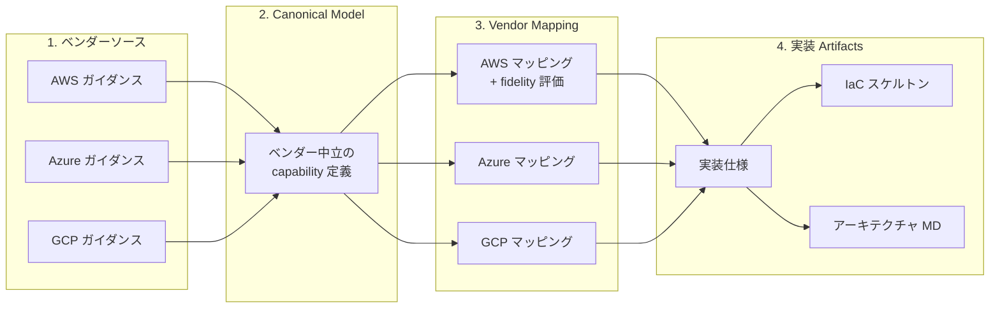

# multi-cloud-lifecycle-skills

AWS / Azure / GCP のマルチクラウド基盤設計を支援する Claude Code スキル群。

ベンダー中立の正規モデルから、ベンダー別マッピング、実装仕様、IaC スケルトンまでを一貫して生成します。

## コンセプト

**ベンダーロックインを回避しつつ、各ベンダーのベストプラクティスを踏襲したインフラ設計を、AI エージェントとの対話で構築する。**

クラウドインフラの設計には 2 つの矛盾する要求があります。「特定ベンダーに依存しない設計にしたい」と「各ベンダーが推奨するベストプラクティスに従いたい」です。本スキル群は、この矛盾を 4 層の設計パイプラインで解決します。



| 層 | 役割 | ロックイン回避 | ベストプラクティス踏襲 |
| --- | --- | --- | --- |
| **ベンダーソース** | 公式ドキュメントを自動収集・保存 | -- | 各ベンダーの最新推奨事項を設計根拠にする |
| **Canonical Model** | ベンダー中立の capability として要件を表現 | 特定ベンダーの用語・概念に依存しない | ソースから抽出したベストプラクティスを正規化して反映 |
| **Vendor Mapping** | canonical を各ベンダーサービスに再投影 | fidelity（exact/partial/workaround/gap）で適合度を可視化。ギャップを明示 | ベンダー推奨のサービス選定・構成に従う |
| **実装 Artifacts** | IaC スケルトン、適合性レポート | canonical への適合性を検証。ベンダー変更時は mapping のみ差し替え | ベンダー固有の設定値・モジュール構成を反映 |

この 4 層モデルにより、**クラウドを追加・変更する場合は Vendor Mapping と Implementation Artifacts のみを差し替えれば済み**、Canonical Model（設計の本質）は変わりません。実際にこのサンプルでは、途中で GCP（BigQuery）を追加した際に既存の AWS / Azure 設計を壊さずに拡張できています。

設計プロセス自体は Claude Code との対話で進みます。スキルが選択肢付きのヒアリングを行い、回答に基づいて全 artifact を自動生成します。設計者はアーキテクチャの意思決定に集中でき、YAML テンプレートの記述やベンダー間の差異の調査はスキルが担います。

## 前提条件

- [Claude Code](https://claude.ai/code)
- [pandoc](https://pandoc.org/)（ベンダーソースの HTML → Markdown 変換に使用）

```bash
# macOS
brew install pandoc
```

## インストール

```bash
git clone https://github.com/suwa-sh/multi-cloud-lifecycle-skills.git
cd multi-cloud-lifecycle-skills
```

### グローバルインストール（全プロジェクトで利用）

```bash
./install.sh
```

`~/.claude/skills/` にシンボリックリンクが作成され、どのプロジェクトでもスキルが利用可能になります。

### プロジェクト固有インストール

```bash
./install.sh /path/to/your-project
```

`<project>/.claude/skills/` にシンボリックリンクが作成され、そのプロジェクトでのみスキルが利用可能になります。

## スキル一覧

3つの設計スキルが階層構造で連携します。上位スキルの出力が下位スキルの入力になります。

```
mcl-foundation-design          最上位 — ガードレールを定義
    ↓ foundation-context.yaml
mcl-shared-platform-design     中間 — 共有サービスを定義
    ↓ shared-platform-context.yaml
mcl-product-design             最下位 — 個別ワークロードを設計
```

| スキル | 対象 | 主な出力 |
| --- | --- | --- |
| **mcl-foundation-design** | ランディングゾーン（組織構造、ID、ネットワーク、ポリシー、ログ、課金、セキュリティ） | canonical model, vendor mapping, decision records, IaC skeletons, foundation context |
| **mcl-shared-platform-design** | 共有プラットフォーム（Kubernetes、監視、CI/CD、シークレット管理） | canonical model, service catalog, vendor mapping, IaC skeletons, shared-platform context |
| **mcl-product-design** | 個別ワークロード（コンピュート、DB、キャッシュ、メッセージング） | workload model, vendor mapping, observability spec, cost hints, IaC skeletons |
| **mcl-common** | 3スキル共通のテンプレート・スキーマ・ルール（直接トリガー不要） | — |

## 使い方

### 基本的な流れ

Claude Code で対話的に設計を依頼します。スキルは自動的にトリガーされます。

```
# 1. Foundation（最初に実行）
「AWS と Azure を対象に、3つのBUで foundation 設計をしてください」

# 2. Shared Platform（foundation の後に実行）
「EKS/AKS ベースの共有プラットフォームを設計してください」

# 3. Product（foundation + shared platform の後に実行）
「EC サイトのバックエンド API を設計してください」
```

### 対象クラウドの指定

3クラウド全対応ですが、呼び出し時にサブセット指定が可能です。

```
「AWS のみで foundation 設計をしてください」
「Azure と GCP で共有プラットフォームを設計してください」
```

### ベンダーソースの活用

ベンダーソースが未準備でもスキルは動作します。設計実行時にソースが見つからない場合、公式ガイダンスページから最新コンテンツを自動収集し markdown として保存します。

```
docs/cloud-context/sources/
├── aws/          # AWS Well-Architected, CAF, EKS Best Practices 等
├── azure/        # Azure CAF, Landing Zone, AKS Best Practices 等
└── gcp/          # GCP Architecture Guidance, GKE Best Practices 等
```

収集の優先順位:
1. `docs/cloud-context/summaries/{layer}/` のサマリー（あれば最優先）
2. `docs/cloud-context/sources/{vendor}/` の保存済みソース
3. Web から最新を自動収集（上記が無い場合）

事前にソースを準備したい場合は、公式ページの内容を markdown export して上記ディレクトリに配置してください。収集対象 URL の一覧は `.claude/skills/mcl-common/references/vendor-source-policy.md` を参照してください。

## 設計パイプライン

全スキル共通の 4 層モデルに従います。

```
Vendor Sources → Canonical Model → Vendor Mapping → Implementation Artifacts
```

| 層 | 内容 | 優先度 |
| --- | --- | --- |
| Vendor Sources | クラウドベンダーの公式ガイダンス | 最高 |
| Canonical Model | ベンダー中立の capability 表現 | 高 |
| Vendor Mapping | ベンダー固有サービスへのマッピング（fidelity 評価付き） | 中 |
| Implementation Artifacts | 実装仕様、IaC スケルトン、適合性レポート | 低 |

競合時は上位層を優先します。

## 出力ディレクトリ

3レイヤーすべてを AWS + Azure で実行した場合、利用プロジェクトに以下のディレクトリ構成が生成されます。

```
your-project/
├── specs/
│   ├── foundation/
│   │   ├── input/                          # (任意) ユーザー入力
│   │   └── output/
│   │       ├── foundation-canonical.yaml       # ベンダー中立の基盤モデル
│   │       ├── foundation-mapping-aws.yaml     # AWS マッピング
│   │       ├── foundation-mapping-azure.yaml   # Azure マッピング
│   │       ├── foundation-impl-aws.yaml        # AWS 実装仕様
│   │       ├── foundation-impl-azure.yaml      # Azure 実装仕様
│   │       └── foundation-context.yaml         # 下位スキルへの入力
│   ├── shared-platform/
│   │   └── output/
│   │       ├── shared-platform-canonical.yaml
│   │       ├── shared-platform-mapping-aws.yaml
│   │       ├── shared-platform-mapping-azure.yaml
│   │       ├── shared-platform-impl-aws.yaml
│   │       ├── shared-platform-impl-azure.yaml
│   │       ├── service-catalog.yaml            # プラットフォームサービス一覧
│   │       └── shared-platform-context.yaml    # 下位スキルへの入力
│   └── product/
│       └── output/
│           ├── product-workload-model.yaml     # ワークロード定義
│           ├── product-mapping-aws.yaml
│           ├── product-mapping-azure.yaml
│           ├── product-impl-aws.yaml
│           ├── product-impl-azure.yaml
│           ├── product-observability.yaml      # SLI/SLO、アラート定義
│           └── product-cost-hints.yaml         # コスト最適化戦略
├── docs/
│   └── cloud-context/
│       ├── sources/                            # ベンダーソース（自動収集 or 手動配置）
│       │   ├── aws/
│       │   ├── azure/
│       │   └── gcp/
│       ├── decisions/
│       │   ├── foundation/                     # 基盤の設計判断記録
│       │   ├── shared-platform/
│       │   └── product/
│       ├── conformance/
│       │   ├── foundation/                     # 適合性検証レポート
│       │   ├── shared-platform/
│       │   └── product/
│       └── generated-md/
│           ├── foundation/                     # アーキテクチャドキュメント
│           ├── shared-platform/
│           └── product/
└── infra/
    ├── foundation/
    │   ├── aws/                                # Terraform HCL
    │   └── azure/                              # Terraform HCL or Bicep
    ├── shared-platform/
    │   ├── aws/
    │   └── azure/
    └── product/
        ├── aws/
        └── azure/
```

## YAML 正本ポリシー

- **YAML が全 artifact の正本**。Markdown は常に派生生成物
- 全 YAML に共通メタデータを含む（`schema_version`, `artifact_type`, `skill_type`, `artifact_id`, `title`, `status`, `generated_at` 等）
- IaC のプレースホルダー値には `# TODO:` コメント付き

## 出力サンプル

`sample/` ディレクトリには、3 レイヤーすべてを実行した完全なサンプル出力が含まれています。スキルがどのような artifact を生成するかを理解するためのリファレンスとして利用できます。

### シナリオ

| 項目 | 内容 |
| --- | --- |
| 対象クラウド | AWS（フルスタック）+ Azure（Entra ID IdP 専用）+ GCP（BigQuery 専用） |
| BU 数 | 8（CCoE, マーケティング, 営業, 開発, カスタマーサクセス, 経理, 総務, 経営） |
| 環境 | 本番 / ステージング / 開発（3 面） |
| コンプライアンス | SOC2 Type II |
| 共有ランタイム | EKS + Lambda ハイブリッド |
| CI/CD | GitHub Actions + ArgoCD（GitOps） |
| 監視 | AMP + AMG（マネージド Prometheus / Grafana） |
| データ分析 | BigQuery（dbt による ELT、Looker Studio で可視化） |

### アーキテクチャドキュメント

各レイヤーの設計結果は Mermaid 図付きのアーキテクチャドキュメントとして生成されます。

| レイヤー | ドキュメント | 主な内容 |
| --- | --- | --- |
| Foundation | [基盤アーキテクチャ](sample/docs/cloud-context/generated-md/foundation/foundation-architecture.md) | 組織階層図、認証フロー、ネットワークトポロジ、セキュリティガードレール階層、クロスクラウド監査統合 |
| Shared Platform | [共有プラットフォームアーキテクチャ](sample/docs/cloud-context/generated-md/shared-platform/shared-platform-architecture.md) | EKS+Lambda 構成図、CI/CD パイプラインフロー、オブザーバビリティスタック、テナントオンボーディング |
| Product | [データ分析基盤アーキテクチャ](sample/docs/cloud-context/generated-md/product/product-architecture.md) | データパイプライン全体図、dbt モデル構成、クロスクラウドデプロイメント、SLI/SLO |

### 生成物一覧

```
sample/
├── specs/
│   ├── foundation/
│   │   ├── input/foundation-input.yaml           # ヒアリング結果
│   │   └── output/
│   │       ├── foundation-canonical.yaml          # ベンダー中立モデル（8 capability）
│   │       ├── foundation-mapping-{aws,azure,gcp}.yaml  # 3 クラウドマッピング
│   │       ├── foundation-impl-{aws,azure,gcp}.yaml     # 3 クラウド実装仕様
│   │       └── foundation-context.yaml            # 下位レイヤーへの入力
│   ├── shared-platform/
│   │   ├── input/shared-platform-input.yaml
│   │   └── output/
│   │       ├── shared-platform-canonical.yaml     # 7 capability
│   │       ├── service-catalog.yaml               # 必須 4 + 任意 3 サービス
│   │       ├── shared-platform-mapping-aws.yaml
│   │       ├── shared-platform-impl-aws.yaml
│   │       └── shared-platform-context.yaml
│   └── product/
│       ├── input/product-input.yaml
│       └── output/
│           ├── product-workload-model.yaml        # 取り込み/変換/提供の 3 層
│           ├── product-mapping-gcp.yaml
│           ├── product-impl-gcp.yaml
│           ├── product-observability.yaml         # SLI/SLO/アラート
│           └── product-cost-hints.yaml            # 8 つのコスト最適化戦略
├── docs/cloud-context/
│   ├── sources/{aws,azure,gcp}/                   # ベンダーソース（24 ファイル）
│   ├── decisions/
│   │   ├── foundation/                            # Azure IdP 限定、GCP BQ 限定、コスト按分、NW トポロジ
│   │   ├── shared-platform/                       # ハイブリッドランタイム、GitOps
│   │   └── product/                               # dbt 採用、マルチパターン取り込み
│   ├── conformance/{foundation,shared-platform,product}/  # 適合性レポート
│   └── generated-md/{foundation,shared-platform,product}/ # Mermaid 図付きアーキテクチャ MD
└── infra/
    ├── foundation/
    │   ├── aws/     # 7 モジュール（organizations, audit, security, network 等）
    │   ├── azure/   # 1 モジュール（entra-id）
    │   └── gcp/     # 6 モジュール（resource-hierarchy, identity, org-policy 等）
    ├── shared-platform/
    │   └── aws/     # 6 モジュール（eks, observability, argocd, ecr 等）
    └── product/
        └── gcp/     # 4 モジュール（bigquery-datasets, data-ingestion, dbt, security）
```

### サンプルの再生成

`sample/` の内容を自分の要件で再生成したい場合:

```bash
# sample/ を空にしてからスキルを実行
rm -rf sample/*

# Claude Code で対話的に設計
# 「./sample ディレクトリをルートにしたい」と伝えた上で:
# 1. /mcl-foundation-design
#    agentからの質問に、選択肢から回答
# 2. /mcl-shared-platform-design k8s基盤
#    agentからの質問に、選択肢から回答
# 3. /mcl-product-design データ分析基盤
#    agentからの質問に、選択肢から回答
```

## リポジトリ構成

```
.claude/
├── skills/
│   ├── mcl-common/              # 共通メタスキル
│   │   ├── references/          # 正規化ルール、マッピングルール、競合分類
│   │   ├── templates/           # YAML テンプレート（canonical, mapping, decision 等）
│   │   └── schemas/             # 共通メタデータスキーマ
│   ├── mcl-foundation-design/   # 基盤設計スキル
│   │   ├── SKILL.md
│   │   ├── evals/
│   │   ├── references/ → ../mcl-common/references
│   │   ├── schemas/   → ../mcl-common/schemas
│   │   └── templates/ → ../mcl-common/templates
│   ├── mcl-shared-platform-design/  # 共有プラットフォーム設計スキル
│   │   └── (同構成)
│   └── mcl-product-design/      # プロダクト設計スキル
│       └── (同構成)
├── CLAUDE.md                    # Claude Code 向け指示
└── ...
```

## ライセンス

MIT
