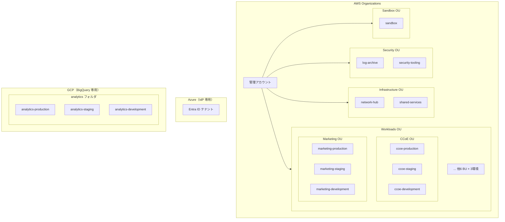
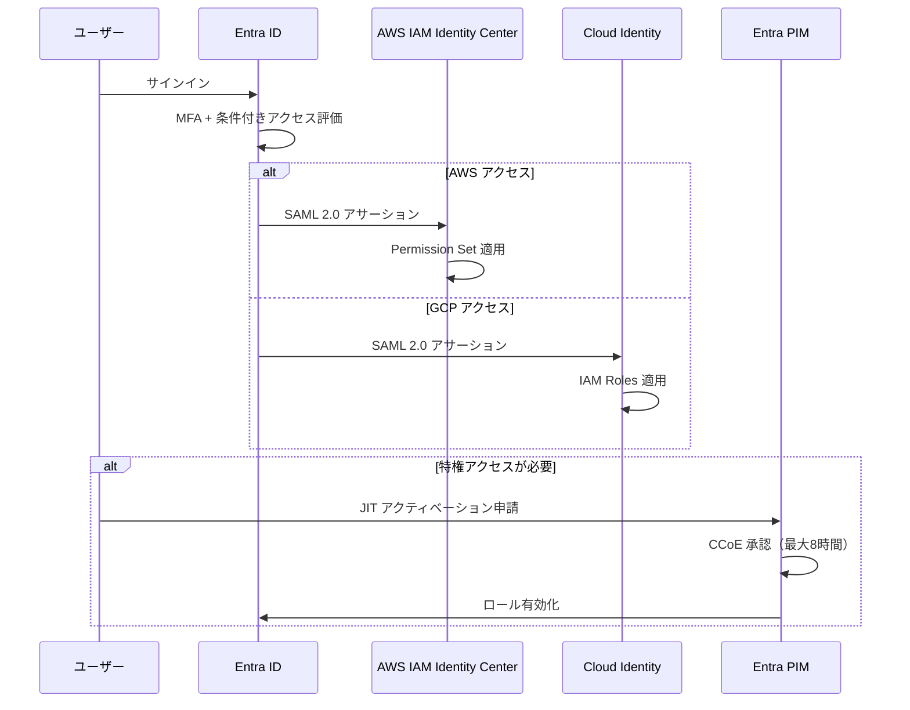
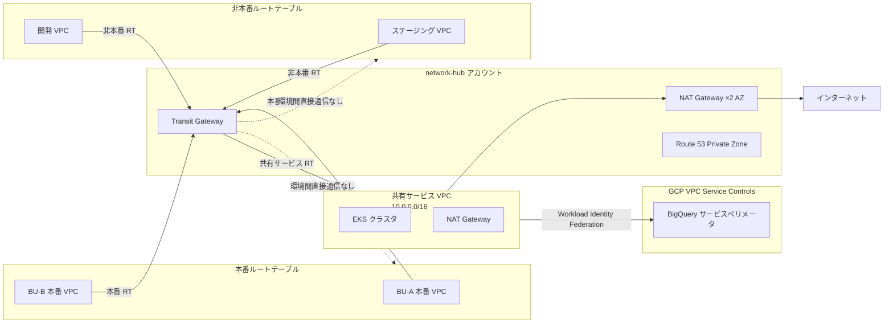
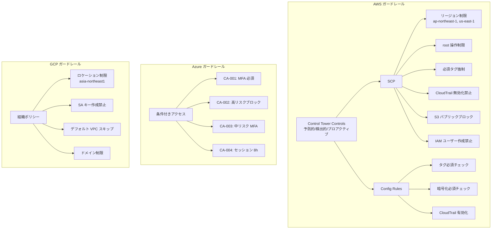
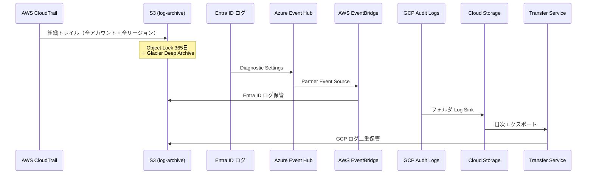

# 基盤レイヤー ターゲットアーキテクチャ

> 生成日: 2026-03-28 | ステータス: draft | 正本: YAML artifact 群

## 概要

本ドキュメントは、マルチクラウド基盤（ランディングゾーン）の設計を要約したターゲットアーキテクチャである。YAML artifact からの派生生成物であり、正本は各 YAML ファイルを参照すること。

### 対象クラウドと利用範囲

| クラウド | 利用範囲 | 主な責務 |
| --- | --- | --- |
| **AWS** | フルスタック | ワークロード実行環境、ネットワーク、ログ集約、セキュリティ |
| **Azure** | IdP 専用 | Entra ID による ID 管理、MFA、PIM、条件付きアクセス |
| **GCP** | BigQuery 専用 | データ分析基盤（BigQuery） |

### 組織情報

- **BU 数**: 8（CCoE, マーケティング, 営業, 開発, カスタマーサクセス, 経理, 総務, 経営）
- **環境**: 本番 / ステージング / 開発（3 面）
- **コンプライアンス**: SOC2 Type II
- **監査ログ保持**: 1 年

---

## 1. 組織境界（Organization Boundary）

### 組織階層図

**合計アカウント数**: 30（管理 1 + Security 2 + Infra 2 + BU×環境 24 + Sandbox 1）

---

## 2. ID 管理（Identity Boundary）

### 認証フロー

### 主要な設計判断

- **唯一の IdP**: Azure Entra ID（全認証の入口）
- **自動プロビジョニング**: SCIM（Entra ID → AWS IAM Identity Center）、GCDS/SCIM（Entra ID → Cloud Identity）
- **ローカルユーザー禁止**: AWS IAM ユーザー、GCP ローカルユーザーともに作成禁止
- **特権管理**: Entra ID PIM による JIT アクセス（最大 8 時間、承認必須）
- **ブレークグラス**: AWS 管理アカウントに IAM ユーザー ×2（ハードウェア MFA）、Entra ID に緊急アクセスアカウント ×2（FIDO2）
- **アクセスレビュー**: Entra ID でロールグループメンバーシップの四半期レビュー
- **AWS → GCP 連携**: Workload Identity Federation（サービスアカウントキー不使用）

---

## 3. ネットワーク分離（Network Segmentation）

### ネットワークトポロジ図

- **環境間通信**: 本番 ↔ 非本番間の直接ルーティングなし
- **エグレス**: 共有 NAT Gateway（2 AZ 冗長）
- **DNS**: Route 53 Private Hosted Zone（internal.example.com）
- **VPC Flow Logs**: 全 VPC → log-archive S3

---

## 4. ポリシー適用（Policy Enforcement）

### セキュリティガードレール階層図

---

## 5. 監査ログ集約（Audit Aggregation）

### クロスクラウド監査統合

| ソース | 保持（一次） | 保持（長期） | 改ざん防止 |
| --- | --- | --- | --- |
| AWS CloudTrail | S3 365 日 | Glacier Deep Archive | Object Lock Governance + ログ整合性検証 |
| Entra ID | UI 30 日 | AWS S3 365 日 | S3 Object Lock |
| GCP Audit Logs | Cloud Logging 30 日 | Cloud Storage 365 日 + AWS S3 | バケットロック |

---

## 6. セキュリティガードレール（Security Guardrails）

| 機能 | AWS | Azure | GCP |
| --- | --- | --- | --- |
| 脅威検出 | GuardDuty | Entra ID Protection | SCC Standard |
| セキュリティ状態管理 | Security Hub (FSBP) | Identity Secure Score | SCC Health Analytics |
| 暗号化デフォルト | EBS/S3/RDS 有効 | N/A | BigQuery デフォルト |
| 通知 | SNS → Slack | リスクポリシー自動対応 | Pub/Sub → Slack |

---

## 7. 課金境界（Billing Boundary）

- **予算責任**: BU 単位
- **按分モデル**: 固定＋変動ハイブリッド
  - 固定費（TGW, CloudTrail, Security Hub 等）→ 8 BU 均等割
  - 変動費（コンピュート, ストレージ等）→ 利用量比例（cost-center タグ）
- **Azure コスト**: Entra ID ライセンス → 全社共有
- **GCP コスト**: BigQuery 利用料 → 全社共有の分析基盤コストとして按分
- **必須タグ/ラベル**: cost-center, environment, owner（AWS）/ cost-center, environment, service（GCP）
- **異常検知**: AWS Cost Anomaly Detection 有効

---

## 8. 例外処理（Exception Handling）

- **逸脱管理**: 全クラウド統一の deviation_record プロセス
- **承認者**: CCoE（high 以上は経営層承認必須）
- **有効期限**: 最長 90 日（期限到来時に自動通知）
- **レビュー**: 四半期ごとに全承認済み逸脱を棚卸し

---

## 設計判断一覧

| ID | タイトル | 選択 |
| --- | --- | --- |
| foundation-decision-azure-idp-only | Azure の利用範囲 | Entra ID（IdP）のみ |
| foundation-decision-gcp-bigquery-only | GCP の利用範囲 | BigQuery（データ分析）のみ |
| foundation-decision-cost-allocation | 共有インフラコスト按分 | 固定＋変動ハイブリッド |
| foundation-decision-network-topology | ネットワークトポロジー | ハブ&スポーク（Transit Gateway） |

---

## 適合性サマリー

| ベンダー | 合計要件 | 適合 | 部分適合 | 非適合 | 保留 |
| --- | --- | --- | --- | --- | --- |
| AWS | 39 | 35 | 2 | 0 | 2 |
| Azure | 39 | 15 | 5 | 0 | 19 |
| GCP | 39 | 14 | 5 | 0 | 20 |

保留（deferred）が多い Azure / GCP は、IdP 専用 / BigQuery 専用のスコープ制限によるもの。非適合（non_conformant）は 0 件。
