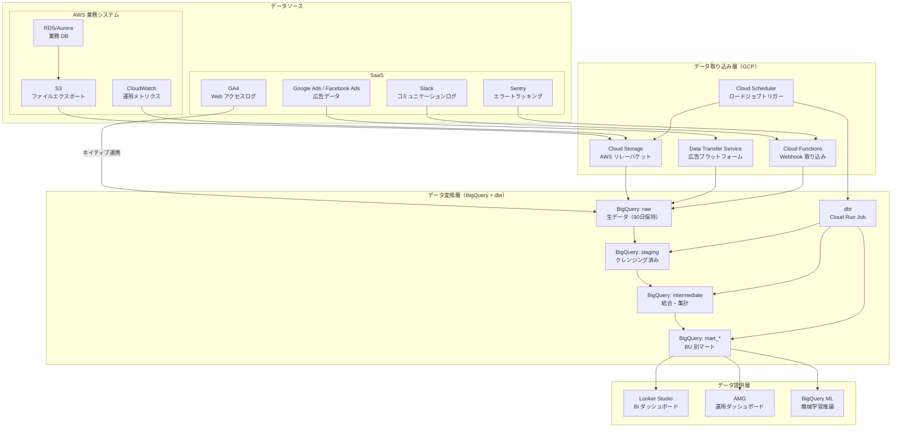
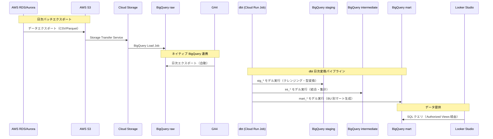
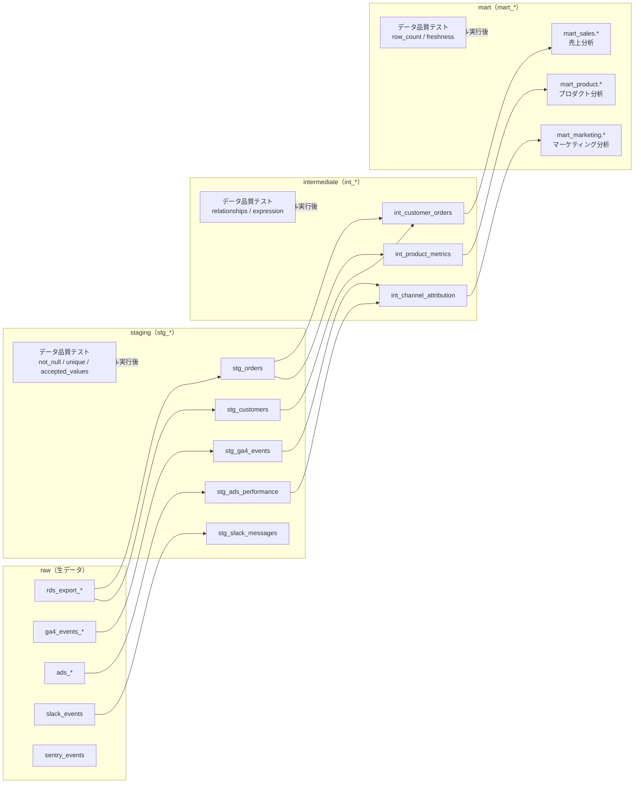
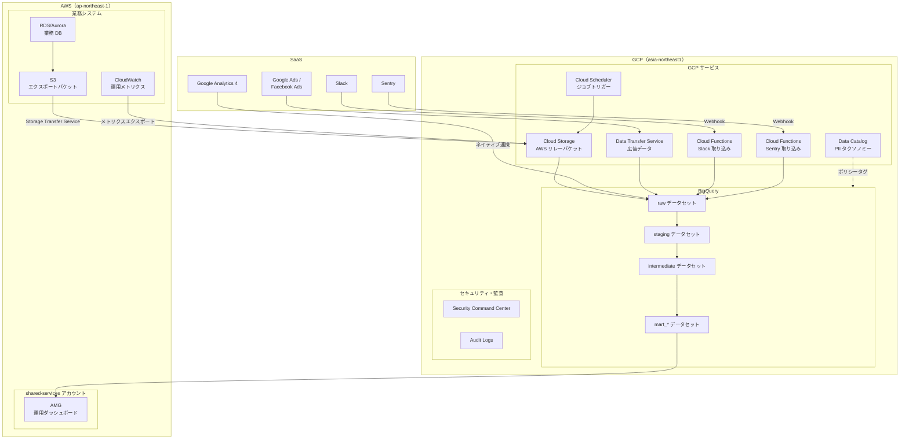

# プロダクト ターゲットアーキテクチャ — BigQuery データ分析基盤

> 生成日: 2026-03-28 | ステータス: draft | 正本: YAML artifact 群

## 概要

本プロダクトは、全社データ分析基盤として GCP BigQuery を中核に据えたデータウェアハウスである。AWS 上の業務システム（RDS/Aurora、S3、CloudWatch）および SaaS（GA4、Google Ads、Slack、Sentry）からデータを集約し、dbt による 4 層変換パイプライン（raw → staging → intermediate → mart）を経て、Looker Studio / AMG / BigQuery ML によるデータ提供を実現する。

### 主要設計方針

- **BigQuery ファースト**: 分析ワークロードは GCP BigQuery に集約し、サーバレスでスケーラブルなクエリ基盤を活用
- **dbt によるデータ変換**: ELT パターンを採用し、データ変換ロジックを SQL + dbt で版管理・テスト可能にする
- **マルチクラウドデータ連携**: AWS の業務データを Cloud Storage 経由でリレーし、SaaS はネイティブ連携・Webhook で取り込む
- **カラムレベルセキュリティ**: Data Catalog ポリシータグと BigQuery データマスキングで PII を保護

---

## ワークロード全体構成図

---

## データパイプラインフロー図

---

## dbt モデル構成図

---

## クラウド別デプロイメント図

---

## サービスカタログサマリー

| サービス | GCP サービス | 必須/任意 | 用途 |
| --- | --- | --- | --- |
| データウェアハウス | BigQuery（4 データセット構成） | **必須** | 分析データの格納・クエリ |
| データリレー | Cloud Storage（ライフサイクル 30 日） | **必須** | AWS → GCP のデータ中継 |
| 広告データ取り込み | BigQuery Data Transfer Service | **必須** | Google Ads 等の定期転送 |
| Webhook 取り込み | Cloud Functions（2nd Gen） | **必須** | Slack / Sentry データ取り込み |
| ジョブスケジューリング | Cloud Scheduler | **必須** | ロードジョブ・dbt トリガー |
| データ変換 | dbt（Cloud Run Job） | **必須** | ELT パイプライン |
| PII 分類・マスキング | Data Catalog + BigQuery Data Policy | **必須** | カラムレベルセキュリティ |
| BI ダッシュボード | Looker Studio | 任意 | ビジネスユーザー向け可視化 |
| 運用ダッシュボード | AMG（AWS 側） | 任意 | クロスクラウド運用監視 |
| 機械学習 | BigQuery ML | 任意 | SQL ベースの ML 推論 |

---

## コスト最適化サマリー

| 最適化項目 | 施策 | 期待効果 |
| --- | --- | --- |
| BigQuery クエリコスト | オンデマンド → スロット予約（Editions）への移行検討 | クエリコスト 30-50% 削減 |
| raw データセット | テーブル有効期限 90 日で自動削除 | ストレージコスト抑制 |
| GCS リレーバケット | ライフサイクル 30 日で自動削除 | 不要データの蓄積防止 |
| BigQuery ストレージ | Long-term Storage 自動適用（90 日未更新で 50% 割引） | ストレージコスト最大 50% 削減 |
| Cloud Functions | min_instance_count = 0 でコールドスタート許容 | アイドル時のコストゼロ |
| dbt 実行 | Cloud Run Job でジョブ実行中のみ課金 | 常時起動のコスト回避 |

---

## SLI/SLO

| SLI | 測定方法 | SLO |
| --- | --- | --- |
| データ鮮度（raw） | raw テーブルの最新パーティション日時と現在時刻の差分 | 24 時間以内 |
| データ鮮度（mart） | mart テーブルの最新更新日時と現在時刻の差分 | 26 時間以内（raw + dbt 処理時間） |
| dbt 実行成功率 | dbt run の成功回数 / 総実行回数 | 99% / 月 |
| クエリ可用性 | BigQuery API の成功レスポンス率 | 99.9% / 月（BigQuery SLA 準拠） |
| データ品質（dbt test） | dbt test の全テスト通過率 | 100%（ブロッキングテスト） |
| Webhook 取り込みレイテンシ | Cloud Functions の p95 実行時間 | 10 秒以内 |

---

## 設計判断一覧

| ID | タイトル | 選択 |
| --- | --- | --- |
| product-decision-bigquery-dwh | データウェアハウス選定 | GCP BigQuery（サーバレス DWH） |
| product-decision-elt-pattern | データ変換パターン | ELT（dbt による BigQuery 内変換） |
| product-decision-4layer-model | データセット構成 | 4 層モデル（raw / staging / intermediate / mart） |
| product-decision-pii-masking | PII 保護方式 | Data Catalog ポリシータグ + データマスキング |
| product-decision-aws-relay | クロスクラウドデータ連携 | Cloud Storage リレー + Storage Transfer Service |

---

*本ドキュメントは YAML 正本からの派生生成物です。内容の変更は YAML 側で行い、再生成してください。*
