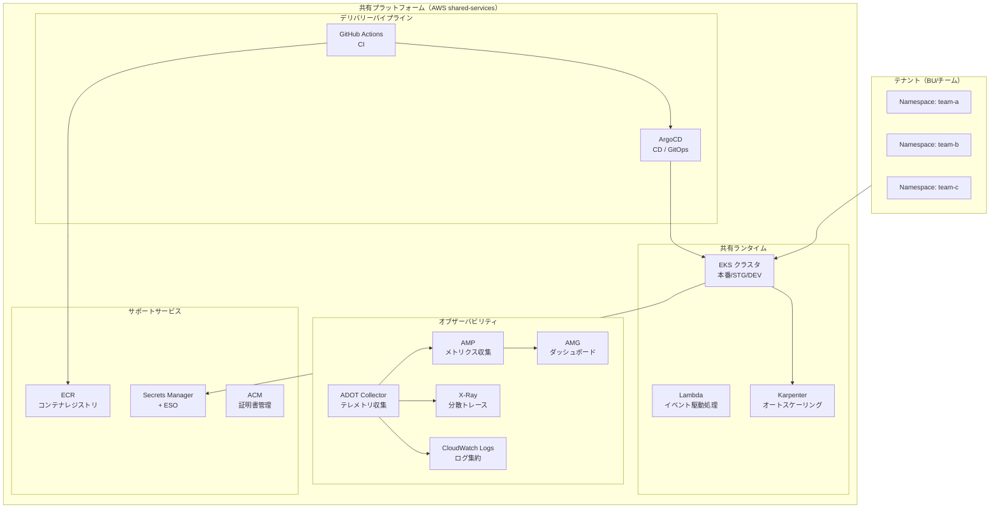
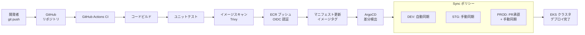
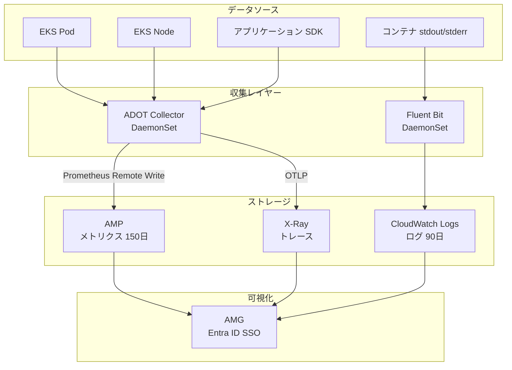
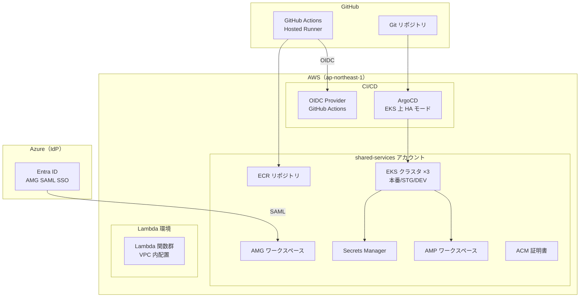
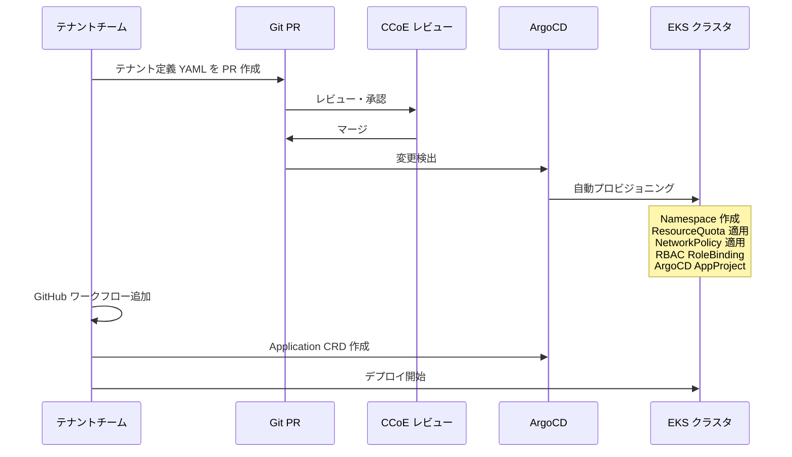

# 共有プラットフォーム ターゲットアーキテクチャ

> 生成日: 2026-03-28 | ステータス: draft | 正本: YAML artifact 群

## 概要

本共有プラットフォームは、EKS + Lambda のハイブリッドランタイム、GitHub Actions + ArgoCD による CI/CD パイプライン、AMP + AMG によるオブザーバビリティスタックを柱とした内部開発者プラットフォームである。CCoE がプラットフォームを一元管理し、テナント（プロダクトチーム）がセルフサービスでワークロードをデプロイできる環境を提供する。

### 主要設計方針

- **マネージドサービス優先**: 運用負荷を最小化（EKS / AMP / AMG）
- **GitOps ベースのデリバリー**: ArgoCD による宣言的デプロイで環境の再現性を担保
- **テナント分離**: Namespace / RBAC / NetworkPolicy / ResourceQuota による論理分離
- **OpenTelemetry 標準**: ADOT Collector で計装を統一

---

## プラットフォーム全体構成図

---

## CI/CD パイプラインフロー図

---

## オブザーバビリティスタック図

| レイヤー | ツール | 収集元 | 保存先 |
| --- | --- | --- | --- |
| メトリクス | ADOT Collector (Prometheus) | EKS Pod / Node | AMP（150 日保持） |
| トレース | ADOT Collector (OTLP) | アプリケーション SDK | X-Ray |
| ログ | Fluent Bit (DaemonSet) | コンテナ stdout/stderr | CloudWatch Logs（90 日保持） |
| ダッシュボード | AMG (Grafana) | AMP / CloudWatch / X-Ray | - |

---

## クラウド別デプロイメント図

---

## テナントオンボーディングフロー

---

## サービスカタログサマリー

| サービス | AWS サービス | 必須/任意 | 提供モデル |
| --- | --- | --- | --- |
| EKS 共有ランタイム | EKS 1.30+ / マネージドノード / Karpenter | **必須** | セルフサービス |
| Lambda ランタイム | Lambda（VPC 内） | **必須** | セルフサービス |
| 統合オブザーバビリティ | AMP + AMG + CloudWatch Logs + X-Ray | **必須** | セルフサービス |
| CI/CD パイプライン | GitHub Actions + ArgoCD | **必須** | セルフサービス |
| アーティファクトレジストリ | ECR（Enhanced Scanning） | 任意 | セルフサービス |
| シークレット管理 | Secrets Manager + ESO | 任意 | セルフサービス |
| テナントオンボーディング | Namespace テンプレート + ArgoCD AppProject | 任意 | 申請ベース |

---

## 設計判断一覧

| ID | タイトル | 選択 |
| --- | --- | --- |
| shared-platform-decision-hybrid-runtime | 共有ランタイム構成 | EKS + Lambda ハイブリッド |
| shared-platform-decision-gitops | CD 戦略 | ArgoCD（GitOps） |

---

*本ドキュメントは YAML 正本からの派生生成物です。内容の変更は YAML 側で行い、再生成してください。*
